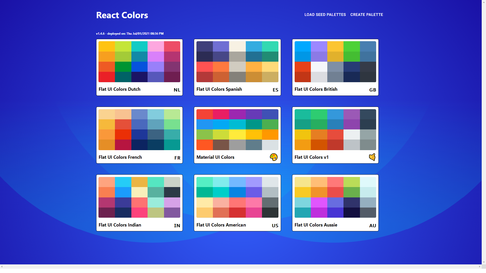
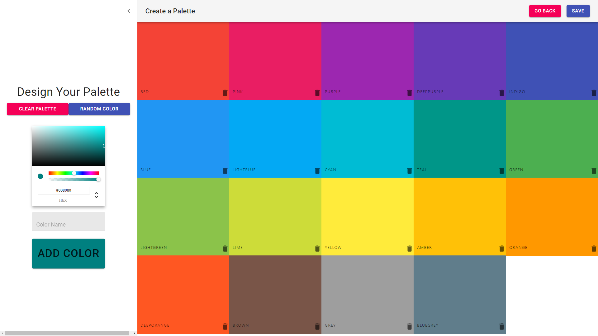
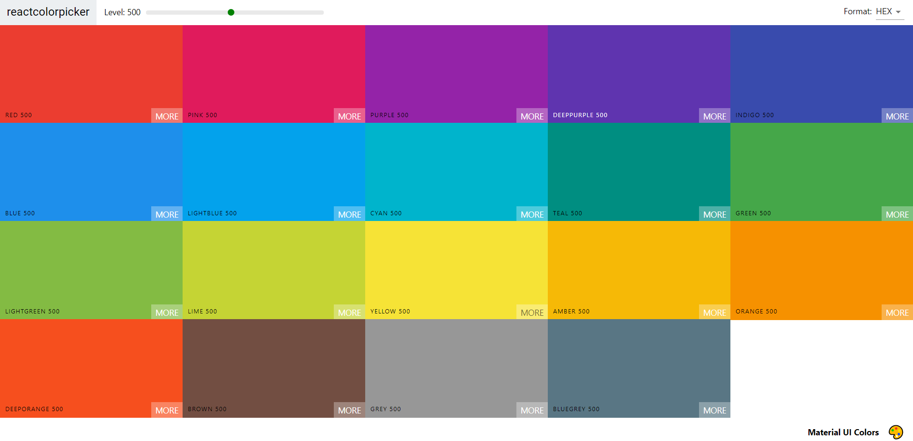
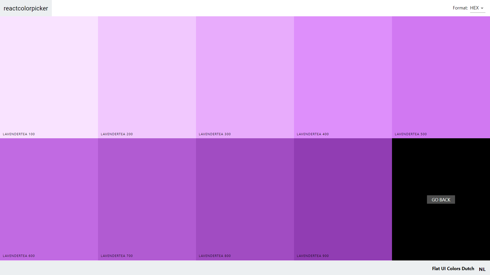
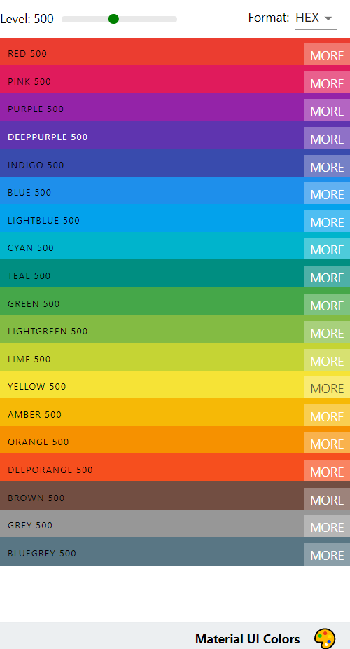
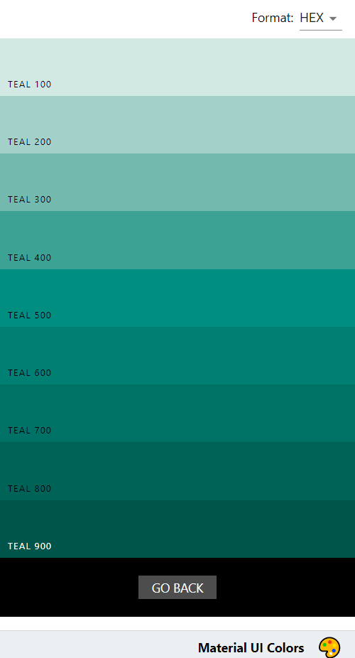

# React Color App

* A clone of websites like [Flat UI Colors](https://flatuicolors.com/) and [Material UI Colors](http://materialuicolors.co/?utm_source=launchers).
* Built as part of Colt Steele's [Modern React Bootcamp course](https://www.udemy.com/course/modern-react-bootcamp/)
  * Colt's project can be found [here](https://github.com/Colt/react-colors)
* Live version of this app can be found [here](https://lr-color-app.herokuapp.com/)
  

# TODO

- **`Ongoing:`**
  - **`Critical:`** Fix README
  - **`Moderate:`** Darkness level should return to last used level
  

- **`Planed:`**
  - **`Minor:`** Add HSL support
  

- **`Done:`**
  - **`Critical:`** ~~Fix warnings~~
  - **`Moderate:`** ~~Check deps updates~~
  

# Long Term Future Plans:

* Reformat the project to use functional components instead of class components - **`ongoing`**
* Reformat the project with a state manager (Redux probably).
* Rewrite using TypeScript.
  

# Screenshots

Main Page

  

Create New Palette

  

Single Palette

  

Single Color

  

Single Palette - Small&nbsp;&nbsp;&nbsp;&nbsp;&nbsp;&nbsp;&nbsp;&nbsp;&nbsp;&nbsp;&nbsp;&nbsp;&nbsp;&nbsp;&nbsp;&nbsp;&nbsp;&nbsp;&nbsp;&nbsp;&nbsp;&nbsp;&nbsp;&nbsp;&nbsp;&nbsp;&nbsp;&nbsp;&nbsp;&nbsp;&nbsp;&nbsp;&nbsp;&nbsp;&nbsp;&nbsp;&nbsp;&nbsp;&nbsp;&nbsp;&nbsp;&nbsp;&nbsp;&nbsp;&nbsp;&nbsp;&nbsp;&nbsp;&nbsp;&nbsp;&nbsp;&nbsp;&nbsp;&nbsp;&nbsp;&nbsp;&nbsp;&nbsp;&nbsp;&nbsp;&nbsp;&nbsp;&nbsp;&nbsp;&nbsp;&nbsp;Single Color - Small

